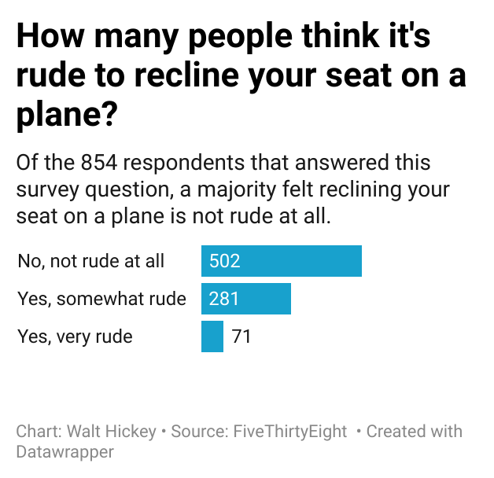

# Etiquette-Survey-Data
I picked the question "Is it rude to recline your seat on a plane?" because I am interested in people's opinions about the matter. This is a recurring question amongst people when it comes to plane etiquette. I thought that many people would feel like it was rude. My chart shows that a majority of respondents do not feel like reclining in a plane seat is rude at all. This can exemplify how diverse opinions are when it comes to plane etiquette and how preconceived notions about plane etiquette may not be so common.

